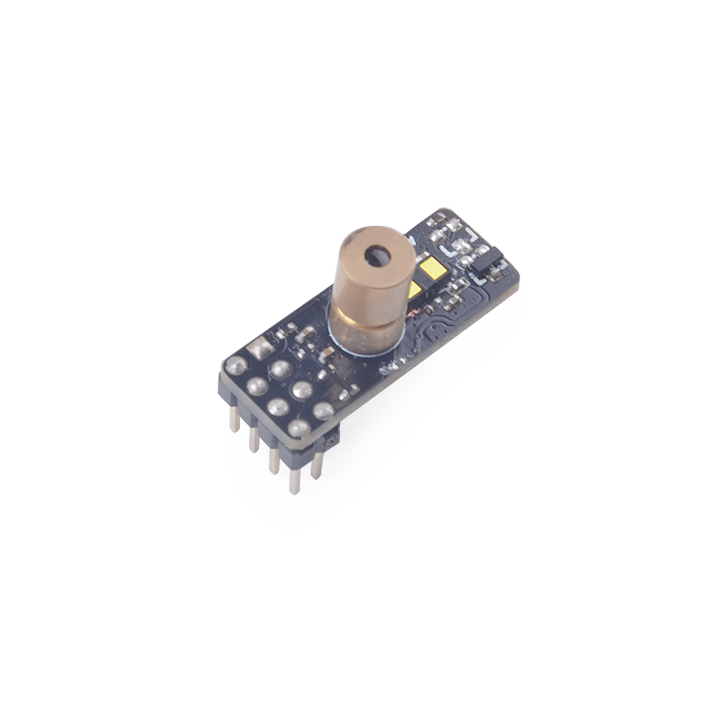
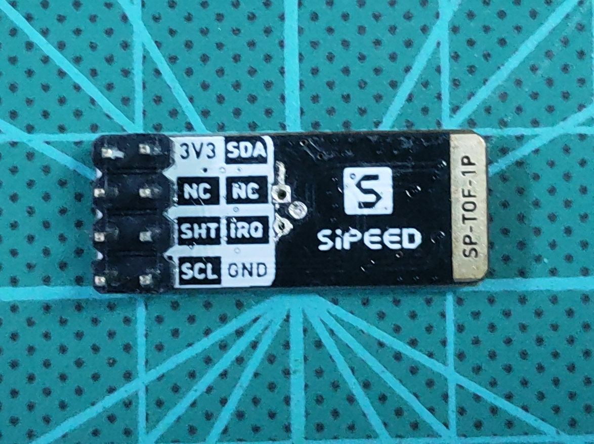
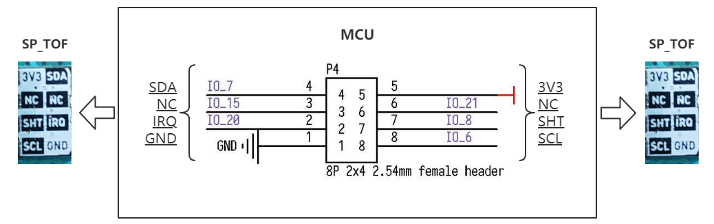
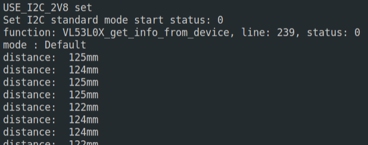

# SP_TOF 模块使用说明
    
[English](README.md)

## 目录结构

|  目录  | 描述           |
| :----: | :------------- |
|  doc   | 参考文档       |
|  img   | 图片           |
| script | MaixPy脚本示例 |
|  src   | C裸机程序示例  |

## 介绍



本模块所采用的 VL53L0X 传感器是一个 I2C 接口，长距离单点飞行时间测定（ToF）传感器，它具有高性能和高可靠性, 最远距离4m, 最高50hz的刷新率, 搭配红色激光瞄头, 通过 XSHUT 控制激光开光, 使用 SP_MOD 进行连接.

*查看[模块规格书](doc/SP-ToF(1P)规格书V1.0.pdf)获取更多特性信息*

## 引脚图



## 接线方式



|  MCU:FUN(IO)  | SP_RFID |
| :-----------: | :-----: |
| I2C:SDA(IO_7) |   SDA   |
|   NC(IO_15)   |   NC    |
| NC(IO_20)     |   IRQ   |
|   NC(IO_21)   |   NC    |
| GPIOHS(IO_8)  |   SHT   |
| I2C:SCL(IO_6) |   SCL   |
|   2.8~3.5V    |  3.3V   |
|      GND      |   GND   |

## MCU 配置

### IO 配置

将 MCU 原理图对应的 IO 口配置为 I2C 功能引脚。

* C 示例
  
  ```c
    //set io mux
    fpioa_set_function(VL53L0X_SCL, FUNC_I2C0_SCLK + VL53L0X_I2C_DEVICE * 2);
    fpioa_set_function(VL53L0X_SDA, FUNC_I2C0_SDA + VL53L0X_I2C_DEVICE * 2);
    fpioa_set_function(VL53L0X_SHT, FUNC_GPIOHS0 + VL53L0X_SHT);

    gpiohs_set_drive_mode(VL53L0X_SHT, GPIO_DM_OUTPUT);
  ```

* MaixPy 示例
  ```python
    fm.register(VL53L0X_SHT, fm.fpioa.GPIOHS0, force=True)
    XSHUT = GPIO(GPIO.GPIOHS0, GPIO.OUT)
  ```

### I2C 初始化

* C 示例
  
  ```c
    //i2c init
    maix_i2c_init(VL53L0X_I2C_DEVICE, 7, VL53L0X_I2C_FREQ_KHZ * 1000);
  ```

* MaixPy 示例
  ```python
    i2c = I2C(VL53L0X_I2C_NUM, freq=VL53L0X_FREQ, scl=VL53L0X_SCL, sda=VL53L0X_SDA)
  ```

## 使用方式

* 流程
  1. 初始化
  2. 校准(可选)
  3. 读取距离(多种模式可选)

* C 示例

  ```c
    while (vl53l0x_init(&vl53l0x_dev)) {
          printf("VL53L0X init error!!!\r\n");
          msleep(500);
    }

    printf("VL53L0X init success!\r\n");

    // adjusting
    printf("VL53L0X adjusting\r\n");
    vl53l0x_calibration_test(&vl53l0x_dev);

    // get distance
    printf("VL53L0X start work\r\n");
    vl53l0x_general_test(&vl53l0x_dev);
  ```
  
* MaixPy 示例
  ```python
    # create obj and read distance
	  tof = VL53L0X(i2c)
	  while True:
      mm = tof.read()
      utime.sleep_ms(100)
      print(mm)
  ```

## 运行环境

|  语言  | 开发板    | SDK/固件版本                    |
| :----: | :------- | :----------------------------- |
|   C    | MaixCube | kendryte-standalone-sdk v0.5.6 |
| MaixPy | MaixCube | maixpy v0.5.1                  |

## 运行结果

* C

  

* MaixPy

  

## 移植

修改以下参数即可适配其他 K210 开发板.

* C

```c
  // board_config.h
  #define VL53L0X_I2C_DEVICE 0 // i2c device number
  #define VL53L0X_I2C_FREQ_KHZ 100 // i2c frequence
  #define VL53L0X_SCL 6 // scl
  #define VL53L0X_SDA 7 // sda
  #define VL53L0X_SHT 8 // sht
```

* MaixPy

```python
  ################### config ###################
  VL53L0X_I2C_NUM = const(I2C.I2C0)
	VL53L0X_FREQ = const(100000)
	VL53L0X_SCL = const(6)
	VL53L0X_SDA = const(7)
	VL53L0X_SHT = const(8)
  ##############################################
```

## 许可

请查看 [LICENSE](LICENSE.md) 文件.

## 相关信息

| 版本号 |   编辑人   |
| :----: | :--------: |
|  v0.1  | vamoosebbf |
